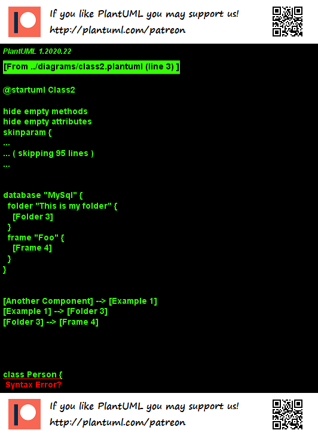

# 🌻 PlantUML Styles

This repository includes styles to be used in PlantUML diagrams.
Check out the examples (e.g. [modern-style examples](examples/modern-style/readme.md)).

You'll get such diagrams by default:



## 🛴 Usage

To use a certain style, include a style-file (from the `styles` directory of this repository) at the beginning of `plantuml` file:

```
@startuml Style Usage Example

!include styles/modern-style.plantuml

class Example {
    + void hello()
    - void hi()
    # void goodMorning(String name)
    ~ String name_
}

@enduml
```

## 🛠️ Customization

The styles use variables, e.g. for defining the primary color.
You can change these variables for a customization of your plantuml style.

```
' Color schema
!$primaryColor = "#ffd1fb"
```

## 🖉 Acknowledgement

The examples used to illustrate the styles are heavily based on the examples provided by [PlantUML](https://plantuml.com/de/).
