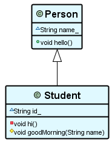

# 🌻 PlantUML Styles

This repository includes styles to be used in PlantUML diagrams.
Check out the examples (e.g. [blue-style examples](examples/blue-style/readme.md)).

You'll get such diagrams by default:



## Usage

To use a certain style, include a style-file (from the `styles` directory of this repository) at the beginning of `plantuml` file:

```
@startuml Style Usage Example

!include styles/blue-style.plantuml

class Example {
    + void hello()
    - void hi()
    # void goodMorning(String name)
    ~ String name_
}

@enduml
```
